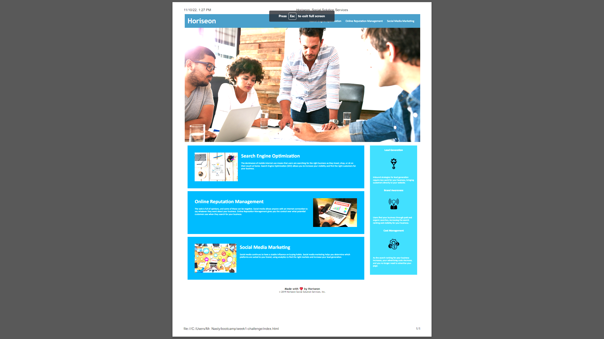

# <Your-Project-Title>

## Description

I started this project knowing that I could face this situation in a real world application.  The goal of this project was to clean up the CSS and HTML so it had better flow and used proper semantic html elements.  I consolidated the CSS so it was easier to read through and so there wasn't any unnecessary coding.  In the HTML I added proper semantic elements and alt attributes to make viewing the webpage easier and also for easier viewing of the code.  I learned that having proper code and using the correct elements in HTML and having less CSS that gives the same result makes reviewing the code much easier.

## Installation

In order to start this project I had to pull the starting code from the class Gitlab and copy the files to my local repository. After that I pushed everything to a remote repository that I had created for the project to keep everything backed up and up to date.

## Usage

The use of this project was to show that I understand how HTML and CSS should flow and look for easier review.

